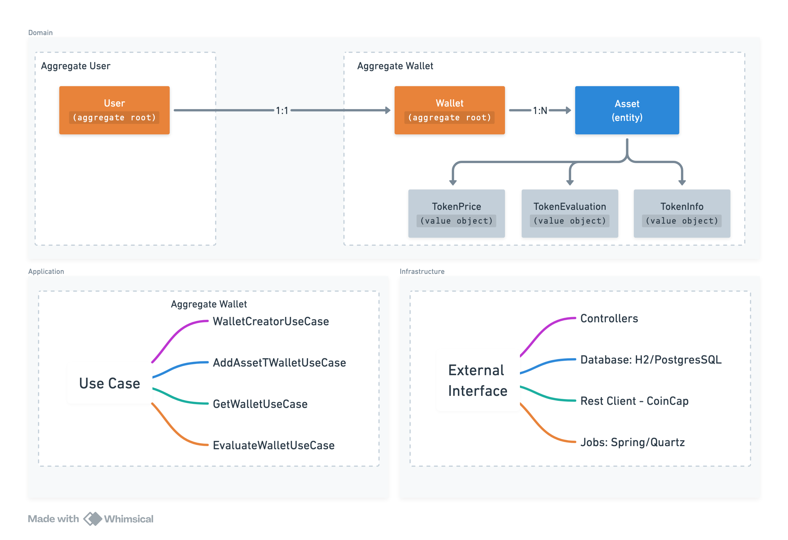

# 💰 Crypto Wallet Platform

This project is a backend system for tracking cryptocurrency assets in user wallets. It allows users to manage their
assets, keep them updated with real-time prices, and evaluate the wallet’s performance based on historical data.

---

## 🧠 Architecture & Domain Model

### 🧩 Domain Aggregates

- **User (Aggregate Root)**: Identified by email. Each user owns one wallet.
- **Wallet (Aggregate Root)**: Handles all logic for managing crypto assets.
- **Asset (Entity)**: Represents a crypto token held in the wallet.
- **TokenPrice (Value Object)**: Stores current or historical token price.
- **TokenInfo (Value Object)**: Metadata from CoinCap API (symbol, asset ID).
- **TokenEvaluationDate (Value Object)**: Represents the evaluation date context.

---

## 🧭 Architecture Overview

The diagram below summarizes the domain model, use cases, and infrastructure boundaries:



---

## 📦 Modular Design

- **crypto-wallet-platform/**  
  Main project container. Future modules like `auth`, `gateway`, etc., could be added here.

- **crypto-wallet-api/**  
  The core backend application. Organized by layer:

  ```
  ├── application/
  │   └── wallet/
  │       ├── create/
  │       ├── addAsset/
  │       ├── evaluate/
  │       ├── get/
  │       └── UseCase.java
  ├── domain/
  │   ├── wallet/
  │   │   ├── Wallet.java
  │   │   ├── Asset.java
  │   │   ├── token/
  │   ├── user/
  │   └── exceptions/
  ├── infrastructure/
  │   ├── controller/
  │   ├── job/
  │   ├── persistence/
  │   ├── restclient/
  │   └── configurations/
  └── resources/
      ├── application.yml
      ├── application-dev.yml
      ├── db.migration/
  ```

---

## 🚀 Features

### ✅ Wallet Creation

- A wallet is created when a user registers using an email.
- One wallet per user is enforced.

### ✅ Add Asset

- Add or update assets to a wallet.
- Fetches current token price and persists it.

### ✅ Token Price Tracking

- Background job refreshes token prices.
- Concurrency: updates 3 tokens in parallel.
- Frequency: configurable via `application.yml`.

### ✅ Wallet Evaluation

- Evaluate wallet value (now or by date).
- Calculates:
    - `total`: Total wallet value in USD.
    - `best_asset` / `worst_asset`: Most and least performing tokens.
    - `best_performance` / `worst_performance`: Percent change.

### ✅ Jobs

- **TokenInfoRefresherJob**: Refreshes metadata from CoinCap.
- **TokenPriceUpdaterJob**: Periodically fetches current token prices.

---

## 🔄 API Overview

| Endpoint                         | Description                       |
|----------------------------------|-----------------------------------|
| `POST /api/wallets`              | Creates a new wallet for a user   |
| `PATCH /api/wallets/{id}/assets` | Add or update asset to wallet     |
| `POST /api/wallets/evaluation`   | Evaluate current/historical value |

---

## 🧪 Tests

- Unit tests on domain and use cases.
- `AddAssetToWalletUserCaseTest`, `EvaluateWalletUseCaseTest`, etc.
- Testcontainers configuration for integration testing with PostgreSQL.

---

## 🛠️ Running the Project

### 🔹 Option 1: Local (H2 + Spring Boot)

```bash
# Build JAR (optional)
./mvnw clean package -DskipTests

# Run using Spring Boot and H2 (default profile)
./mvnw spring-boot:run
```

### 🔹 Option 2: Docker Compose (PostgreSQL + Dev Profile)

A `Makefile` in the project root to simplify Docker commands:

```bash
# Build and start containers with PostgreSQL
make docker-up-dev

# Shutdown and clean up
make docker-down-dev
```

📄 Uses `application-dev.yml` and Flyway migrations.

---

## 📐 Configuration Profiles

| Profile | Description                     |
|---------|---------------------------------|
| default | In-memory H2 for local dev/test |
| dev     | PostgreSQL + Flyway             |

---

## 🔮 What Could Be Improved (Future Work)

| Area           | Idea                                       |
|----------------|--------------------------------------------|
| API Docs       | Add Swagger / OpenAPI                      |
| System Testing | Include E2E tests with Testcontainers      |
| Caching        | Add Redis for static token data            |
| Scheduling     | Replace Spring `@Scheduled` with Quartz    |
| Auth           | Add JWT authentication                     |
| Infra          | CI/CD with GitHub Actions, DockerHub, etc. |

---

## ➕ API Usage (via `curl`)

### 🧑‍💻 1. Create Wallet

```bash
curl --location 'http://localhost:8080/api/v1/wallets' \
--header 'Content-Type: application/json' \
--data-raw '{
    "email": "test@email.com"
}'
Response:
{"id":"2ed25bfa-c4d1-4490-8617-314695477b1c","total":0,"assets":[]}
```

---

### 📦 2. Get Wallet by ID

```bash
curl --location 'http://localhost:8080/api/v1/wallets/2ed25bfa-c4d1-4490-8617-314695477b1c'
Response:
{"id":"2ed25bfa-c4d1-4490-8617-314695477b1c","total":0,"assets":[]}
```

---

### ➕ 3. Add Asset to Wallet

```bash
curl --location --request PATCH 'http://localhost:8080/api/v1/wallets/2ed25bfa-c4d1-4490-8617-314695477b1c/assets' \
--header 'Content-Type: application/json' \
--data '{
    "symbol": "SOL",
    "price": 1000,
    "quantity": 1
}'
Response:
{"id":"2ed25bfa-c4d1-4490-8617-314695477b1c","total":127.4489665883468018,"assets":[{"symbol":"SOL","quantity":1,"price":127.4489665883468018,"value":127.4489665883468018}]}
```

---

### 📊 4. Evaluate Wallet

```bash
curl --location 'http://localhost:8080/api/v1/wallets/evaluations' \
--header 'Content-Type: application/json' \
--data '{
    "assets": [
        {
            "symbol": "BTC",
            "quantity": 0.5,
            "value": 35000
        },
        {
            "symbol": "ETH",
            "quantity": 4.25,
            "value": 15310.71
        }
    ]
}'
Response:
{"status":400,"error":"Token price not found to symbol: Unauthorized to fetch history for: bitcoin","timestamp":"2025-03-16T21:35:52.730692191Z","path":"/api/v1/wallets/evaluations"}
```

---

## 📄 Challenge Requirements

Implemented:

- Evaluate wallet with real-time or historical prices
- Track assets and prices
- Periodic background updates
- JSON-based requests and responses
- Clear architecture and code organization

---

## 🤝 Author

Developed with ❤️ by **Ronaldo Guastalli**
